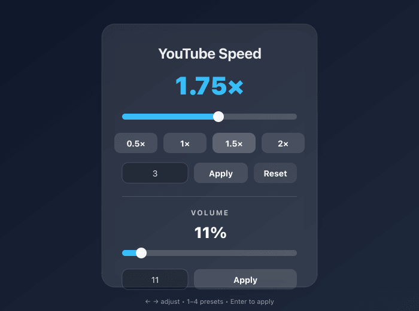

# YouTube Speed Controller (Arc / Chromium Extension)

  <strong>Control YouTube playback speed and volume from a compact browser popup.</strong>

  

The loadable extension lives in `extension/` (that’s the folder you point Arc at when you “Load unpacked”).

## Project overview

**Aim:** Make it fast to adjust a YouTube tab’s playback speed and volume without digging through YouTube’s menus.

**Expected output:** When you open the pop-up on a YouTube tab, it shows the **current** playback speed and volume for that tab and lets you update both. If you change speed/volume using YouTube controls (or shortcuts), the pop-up reflects the new values while it’s open.

## Table of contents

- [Features](#features)
- [Install in Arc](#install-in-arc)
- [How to use](#how-to-use)
- [How it works](#how-it-works-high-level)
- [Project structure](#project-structure)
- [Developing / customizing](#developing--customizing)
- [Notes / limitations](#notes--limitations)

## Features

- Speed slider to adjust from **0.25× → 4×** (applies on release)
- Preset buttons (0.5× / 1× / 1.5× / 2×)
- Manual speed input + **Apply** button (or press **Enter**)
- **Reset** button to return to **1×**
- Volume slider (0–100%) + manual volume input + **Apply**
- Reads the active tab’s current speed/volume (even if changed outside the extension)
- Keyboard shortcuts in the popup:
  - **← / →**: -/+ 0.05×
  - **1–4**: presets (0.5× / 1× / 1.5× / 2×)

## Install in Arc

1. Open `arc://extensions`
2. Enable **Developer mode**
3. Click **Load unpacked**
4. Select: `.../yt-speed-extension/extension`

After any code/icon changes, come back to `arc://extensions` and hit **Reload** on the extension.

> Note: Unpacked extensions require Developer mode. For “always on” installs, publish to the Chrome Web Store (public or unlisted) or use an enterprise policy.

## How to use

1. Open a YouTube video.
2. Click the extension icon in Arc’s toolbar.
3. Use any of:
   - Slider (drag, then release to apply)
   - Presets (click)
   - Manual input (type a number like `1.75`, then **Apply** or **Enter**)
   - **Reset** to return to `1.00×`
   - Volume slider (drag, then release to apply)
   - Manual volume (type a percent like `11`, then **Apply** or **Enter**)

## How it works (high level)

- The popup UI is `extension/popup/index.html` + `extension/popup/popup.js` + `extension/popup/style.css`.
- The popup targets the **active tab in the current window** and sends messages to a YouTube content script.
- The content script (`extension/content.js`) relays commands/state via `window.postMessage` to a small script injected into the page’s **MAIN world** (`extension/page_bridge_main.js`). This allows reading/writing YouTube’s player state more reliably (especially volume).
- The background service worker (`extension/background.js`) injects the MAIN-world bridge when needed and caches the most recent per-tab state for quick reads.

## Project structure

- `extension/`
  - `manifest.json` — MV3 manifest (action popup, icons, permissions)
  - `background.js` — injects MAIN-world bridge + caches per-tab state
  - `content.js` — YouTube content script (popup messaging + state relay)
  - `page_bridge_main.js` — runs in the page’s MAIN world (reads/applies player speed/volume)
  - `popup/` — the popup UI shown when you click the extension icon
  - `icons/` — toolbar/extension icons referenced by the manifest
- `frontend/`
  - A Next.js app (static export) that can be used to prototype a pop-up UI.
  - This repo currently loads the popup from `extension/popup/` (not directly from `frontend/`).

## Developing / customizing

### Edit the popup UI directly

Modify these files, then reload the extension in `arc://extensions`:

- `extension/popup/index.html`
- `extension/popup/popup.js`
- `extension/popup/style.css`

### (Optional) Use the Next.js frontend

The Next.js project is configured with `output: "export"` and will generate static files in `frontend/out/`.

Typical workflow:

1. `cd frontend`
2. `bun run build`
3. Copy the exported files from `frontend/out/` into `extension/popup/`
4. Reload the extension in `arc://extensions`

## Notes/limitations

- The extension targets YouTube pages (`https://www.youtube.com/*`).
- The pop-up only controls the **active** YouTube tab (it won’t change other open YouTube tabs).
- Slider speeds are clamped to **0.25× → 4×**; manual input applies the numeric value you type.
- Volume is expressed as a percentage (0–100%).
